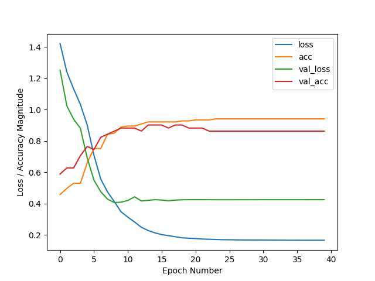

# ROS2 Sign Recognition

## Table of Contents
- [ROS2 Sign Recognition](#ros2-sign-recognition)
  - [Table of Contents](#table-of-contents)
  - [Overview](#overview)
  - [Getting started](#getting-started)
  - [How to use Gazebo simulation environment (optional)](#how-to-use-gazebo-simulation-environment-optional)
    - [Add objects to the world](#add-objects-to-the-world)
    - [How to save world.sdf file](#how-to-save-worldsdf-file)
    - [Update launch file](#update-launch-file)
  - [How to start the line following algorithm](#how-to-start-the-line-following-algorithm)
  - [Save training images (optional)](#save-training-images-optional)
- [Neural network for sign recognition](#neural-network-for-sign-recognition)
  - [Train the neural network (optional)](#train-the-neural-network-optional)
  - [Prepare the environment](#prepare-the-environment)
  - [Usage](#usage)
  - [ROS2 packages used in the project](#ros2-packages-used-in-the-project)
    - [Official ROS2 packages:](#official-ros2-packages)
    - [3rd party packages:](#3rd-party-packages)
    - [The project was based on:](#the-project-was-based-on)

## Overview

This is a ROS2 project for the Cognitive Robotics Laboratory course of the Mechatronics Engineering MSc of the Budapest University of Technology and Economics created by József Ferenczi, Mór Sas, Máté Horváth, Barnabás Szabó and Dániel Sándor.

The task is to simulate a robot with autonomous driving and additional capabilities of sign or pedestrian recognition.

## Getting started

1. Change directory to your `$USER`'s home folder and clone the repository:
   ```bash
   cd;
   git clone https://github.com/barnus877/ros2-sign-recognition;
   ```

2. To run the [Gazebo simulation](#how-to-use-gazebo-simulation-environment), paste the following code into the terminal:
   ```bash
   cd ~/ros2-sign-recognition && colcon build && source install/setup.bash && ros2 launch sign_recognition_bringup world_teleopt.launch.py 
   ```

3. To run the [line following algorithm](#how-to-start-the-line-following-algorithm), paste the following code into a new terminal:
   ```bash
   cd ~/ros2-sign-recognition && source install/setup.bash && ros2 run sign_recognition_py line_follower
   ```

4. To run the [sign recognition node](#neural-network-for-sign-recognition), paste the following code into a new terminal:
   ```bash
   cd ~/ros2-sign-recognition && source install/setup.bash && ros2 run sign_recognition_py sign_recogniser
   ```

## How to use Gazebo simulation environment (optional)

### Add objects to the world

1. Run the project.
2. In Gazebo GUI click the 3 dots (`6`) on the top right corner.
   
3. Add models through the `Resource Spawner` within the `plug-in browser`.
4. Select folder: `~/ros2-sign-recognition/install/sign_recognition_bringup/share/sign_recognition_bringup/gazebo_models/`
   

### How to save world.sdf file

1. Replace all `file:///home/$USER/ros2-sign-recognition/install/sign_recognition_bringup/share/sign_recognition_bringup/gazebo_models/`
   
   ```bash
   <include>
     <uri>file:///home/$USER/ros2-sign-recognition/install/sign_recognition_bringup/share/sign_recognition_bringup/gazebo_models/palya_mogi</uri>
     <name>palya</name>
     <pose>-1.2731360914953953 0.024185007175546058 0 0 0 0</pose>
   </include>
   ```

   with relative path `model://`
   ```bash
   <include>
     <uri>model://palya_mogi</uri>
     <name>palya</name>
     <pose>-1.2731360914953953 0.024185007175546058 0 0 0 0</pose>
   </include>
   ```

2. Delete `turtlebot3_burger`
   ```bash
   <include>
          <uri>file:///home/$USER/ros2_ws/install/turtlebot3_gazebo/share/turtlebot3_gazebo/models/turtlebot3_burger</uri>
       <name>burger</name>
       <pose>4.1577145665028317 2.4008829921053554 0.010008771952750758 6.9807543737599483e-07 -0.012459121963041841 1.   3190277154170922</pose>
   </include>
   ```

### Update launch file

In `src/sign_recognition_bringup/launch/world_teleopt.launch.py` update `world_sign.sdf` with the newly created `.sdf` file.

```bash
world_arg = DeclareLaunchArgument(
    'world', default_value='world_sign.sdf',
    description='Name of the Gazebo world file to load'
)
```

## How to start the line following algorithm

1. Run the project according to the description above: [Getting started](#getting-started)

2. Paste the following code into a new terminal
   ```bash
   cd ~/ros2-sign-recognition && source install/setup.bash && ros2 run sign_recognition_py line_follower
   ```

## Save training images (optional)

Run the `save_training_images` node that can save training images by pressing the `s` key, but before that, make sure that `self.save_path` is set to your own directory by changing `$USER` in the node:

```python
class ImageSubscriber(Node):
    def __init__(self):
        super().__init__('image_subscriber')

        self.subscription = self.create_subscription(
            CompressedImage,
            'image_raw/compressed',  # Replace with your topic name
            self.image_callback,
            1  # Queue size of 1
        )

        self.save_path = "/home/$USER/ros2-sign-recognition/src/sign_recognition_py/saved_images/"
```

If the path is set up correctly we can build, source the project and run the node:
```bash
cd ~/ros2-sign-recognition && colcon build && source install/setup.bash && ros2 run sign_recognition_py save_training_images
```

Run the manual teleoperation node:
```bash
ros2 run teleop_twist_keyboard teleop_twist_keyboard
```

# Neural network for sign recognition

To label the saved images we just simply have to copy the images to the suitable folder under the `training_images` folder. We distinguish 6 labels:
- Limit 5
- Limit 40
- Limit no
- Lived place
- No sign
- Stop

## Train the neural network (optional)

The `sign_recognition_py` package already has a trained network in the `network_model` folder that is ready to use. This model was trained using the following Tensorflow and Keras version:
```
Tensorflow version: 2.18.0
Keras version: 3.14.1
```

There is a simple python training script in the package, called `train_network.py`.
First, navigate to the right folder then run the script:

```bash
cd ~/ros2-sign-recognition/src/sign_recognition_py/sign_recognition_py/ && python train_network.py
```

Let's see the results:



## Prepare the environment

```bash
# 1. cd into the project's root folder
cd ~/ros2-sign-recognition/

# 2. Install colcon into your active virtual environment
python3 -m pip install colcon-common-extensions

# 3. Clear out the old system-python-linked builds
rm -rf build/ install/ log/

# 4. Rebuild the workspace (now colcon will use your tf environment's Python)
colcon build --symlink-install

# 5. Source the built workspace
source install/setup.bash
```

## Usage

After rebuilding with colcon build, run:
```bash
cd ~/ros2-sign-recognition && source install/setup.bash && ros2 run sign_recognition_py sign_recogniser
```

To adjust the evaluation rate at runtime:
```bash
ros2 run sign_recognition_py sign_recogniser --ros-args -p eval_interval:=0.5
```

## ROS2 packages used in the project

### Official ROS2 packages:
- [turtlebot3_gazebo](https://wiki.ros.org/turtlebot3_gazebo)
- [ros_gz_sim](https://github.com/gazebosim/ros_gz)

### 3rd party packages:
- [mogi_trajectory_server](https://github.com/MOGI-ROS/mogi_trajectory_server)

### The project was based on:
- [Week-1-8-Cognitive-robotics](https://github.com/MOGI-ROS/Week-1-8-Cognitive-robotics)


